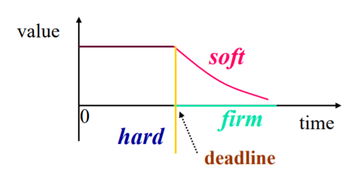
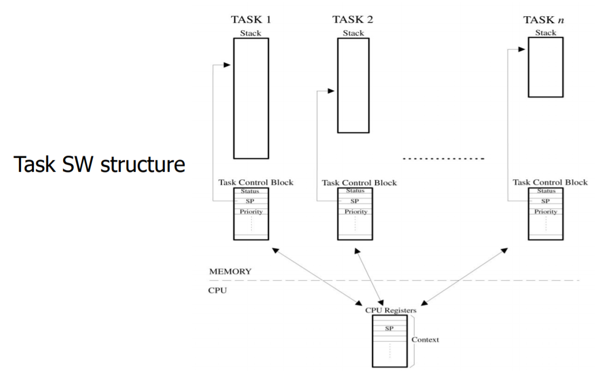
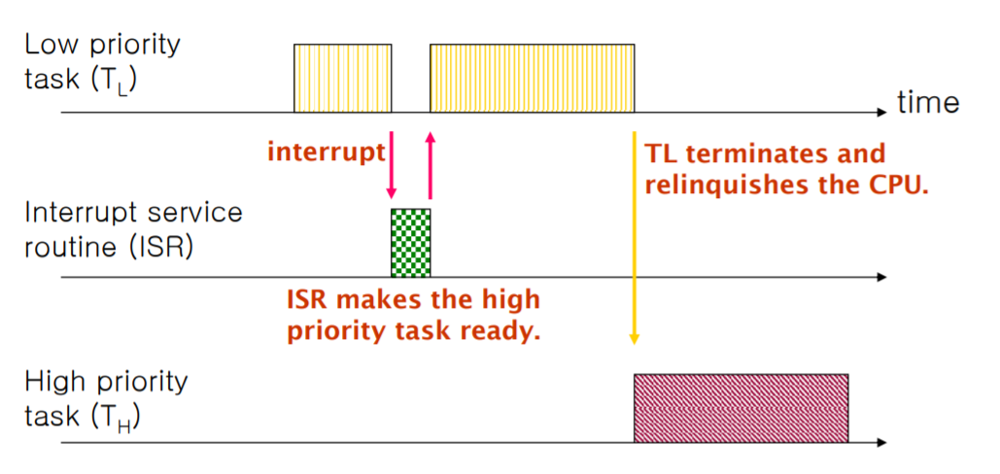
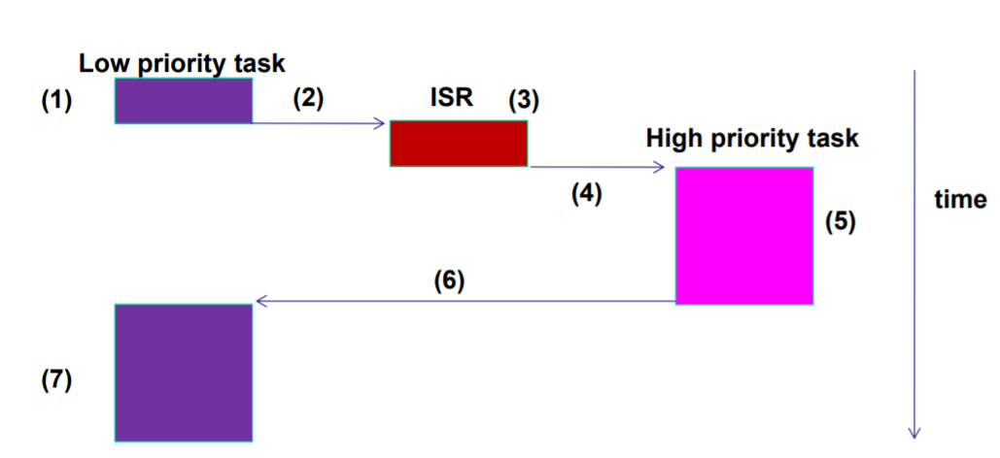

# RTOS Overview

## Overview : Real-Time System

Real-Time System의  correctness는 시스템의 기능적 특성(Functional and Logical character)뿐만 아니라 시간적 특성(Temporal character)까지 고려되는 system이라고 할 수 있다. 시스템이 반드시 지켜야하는 Time Constraint가 존재한다.

Real-Time System이 정해진 시간내에 수행해야 하는 작업을 Task라고 한다. Task는 Time Constraint가 지켜지지 않았을 때의 penalty 정도에 따라서 다음 3가지로 분류할 수 있다.

- Hard real-time task : dead line miss시 가치가 마이너스 무한대로 떨어지는 심각한 경우
- Soft real-time task : dead line miss 후에 가치가 점진적으로 떨어지는 경우
- Firm real-time task : dead line miss 후에 가치가 바로 0으로 떨어지는 경우

## Overview : RTOS(Real Time Operating System)

Real Time System에서 사용하는 운영체제. Real Time이라는 말의 뜻은 작업이 주어졌을 때 정해진 시간내에 해당 작업을 완료해야한다는 의미이다. General Purpose OS는 태스크(스레드)가 얼마다 공평히 cpu자원을 나눠갖는가가 중요하다면, Real time system 용 OS는 자원을 조금 낭비하더라도 주어진 작업을 제한시간 내에 실행할 수 있게하는 것이 더 중요하다. RTOS의 요구사항은 다음과 같다.

- 예측가능하고 일정한 응답 시간
- 우선순위 기반 스케줄링 지원
- Dead Line 기반 스케줄링 지원

## Several Concepts

### Fore Ground / Back Ground

Round Robin with Interrupt에서 하드웨어 인터럽트를 처리하는 ISP와 태스크 처리 루틴이 있는 main 함수 루프를 생각하면 된다.

### Multitasking

task란 어떤 목적을 달성하기 위해서 수행해야 하는 일들을 프로그램의 논리적 단위로 나눈 개념이라 할 수 있다. 목적을 달성하기 위해서는 여러 task가 동시에 수행될 필요가 있으며, 순차적 실행으로는 달성하기 어렵기 때문에 멀티태스킹 개념이 등장하였다. 멀티태스킹에서는 수행해야 할 작업들의 모듈화, 작업들의 수행순서, cpu 사용권 전환, cpu의 효율적인 사용 등을 다룬다.

### Resource

Process나 Task가 사용할 수 있는 모든 요소를 의미한다. 여기에는 하드웨어 자원뿐만 아니라 변수나 배열과 같은 소프트웨어 자원까지 포함된다.

### Shared Resource

하나 이상의 Process나 Task가 공유해서 사용하는 자원을 의미한다. RTOS에서 Dead line missing을 일으킬 수 있는 요인이기 때문에 중요하게 살펴봐야 한다. 어떤 process나 Task가 Shared Resource를 사용하기 위해서는 일단 그 자원에 대한 exclusive access를 얻어야 한다.

### Task

Thread라고도 하며 cpu자원을 할당받아 특정 기능을 수행하는 간단한 프로그램이다. 각 Task는 cpu 레지스터 집합, 우선순위, 스택 사이즈를 할당받는다.

### Context Switch

- Context : Task가 cpu를 점유하여 실행될 때 사용하는 cpu 레지스터의 값들과 같이 Task가 보관해야할 정보들을 의미한다.
- Context Switch : 현재 Running 상태에 있는 Task가 다른 Task에게 cpu를 양보하는 상황을 생각해보자. 이 때 실행되고 있던 Task의 Context를 스택이나 TCB에 저장해두고, 다음에 실행될 Task의 Context를 스택이나 TCB에서 cpu 레지스터로 복사하는 일련의 과정을 Context Switch라고 한다.

### Scheduler

READY 상태에 있는 Task 들 중 다음에 어떤 Task가 실행될 것이지를 결정하는 프로그램이다. Real Time System에서는 우선순위가 가장 높은 Task를 실행시키는 priority 기반 스케줄링을 한다.

### Non-preemptive Kernel

어떤 Task가 수행되고 있을 때, Kernel이 다른 Task가 실행될 수 있도록 할 수 없는 형태. Coopertative Kernel이라고도 한다(프로그래머가 프로그래밍시 non-preemptive에 대한 특성을 고려해야 하기 때문). 테스크가 cpu를 양도하려면 명시적으로 kernel 서비스를 호출 해야한다. 인터럽트에 대해서는 Task의 실행을 중지 시키고, 곧바로 ISR을 실행하며 ISR이 실행된 후에는 반드시 전에 실행하고 있던 Task로 돌아온다.

장점

- 세마포어 등 공유자원을 보호하기 위한 고려를 하지 않아도 된다.
- Task 수행시 비재진입 함수를 사용할 수 있다.
- ISR에 대한 지연시간이 짧다.

단점

- 현재 낮은 우선순위의 Task가 실행 중이라면 높은 우선순위의 Task가 실행 가능 상태가 되더라도 실행이 지연될 수 있다(응답성이 낮아진다). 때문에 Real Time Property가 보장되지 않을 수 있다.

### Preemptive Kernel

우선순위가 높은 Task가 실행 가능 상태에 있으면 해당 Task가
항상 실행되는 형태이다. ISR이 수행될 때 상위 우선순위의 Task를 실행 가능상태로 바꾸고, ISR이 종료되면 스케줄링에 의해 해당 Task가 cpu를 점유하게 된다(ISR는 스케줄링에 대한 통로이다).

### Cyclic Excutive

Multitasking Real Time System 운영체제의 가장 간단한 형태. 미리 모든 Task와 ISR까지 실행 순서를 시간에 따른 table 형태로 정하는 것을 의미한다. 이러한 운영체제가 Real Time Feature를 만족시키기 위해서는 table 구성시 해당 실행순서가 Dead Line을 만족시키는지에 대한 완벽한 계산이 끝나야 한다. Interrupt 처리에 대한 작업도 미리 table 순서에 정해져서 실행된다. 이 때문에 현재 Interrupt 발생했더라도 해당 Interrupt에 대한 처리 순서가 되지 않으면 ISR이 실행되지 않는다.

장점

- 구현이 매우 간단하다
- 오버헤드가 적다
- 모든 운영체제의 동작을 예측하기 쉽다

단점

- Task 실행시 다른 Task의 선점(preemption) 불가능
- 이미 구성된 table에 대해서 다른 작업을 추가하기가 어렵다
- 모든 스케쥴링이 수작업으로 이루어진다

## RTOS Characteristic

- multitasking
- small size
- fast context switch
- fast processing of external interrupt
- external interrupt에 대한 처리가 끝난 시점에 스케줄링이 발생
- simple command line interpreter
- intertask communication and synchronization
- no memory protection : 유저와 시스템이 메모리를 공동으로 사용
- applicaion programs use system calls
- limited memory usage
