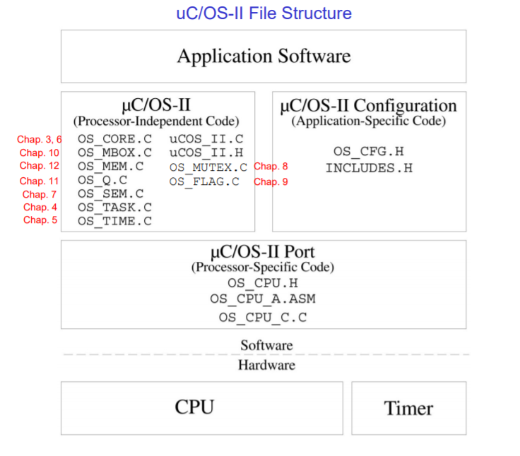
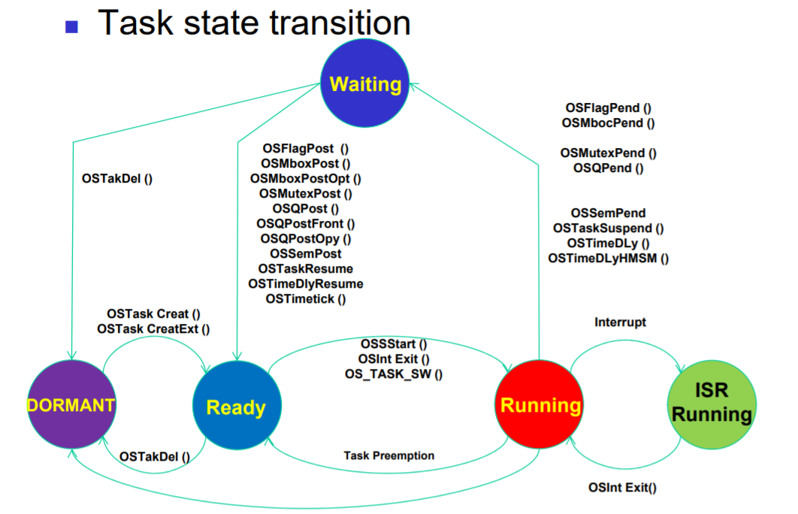
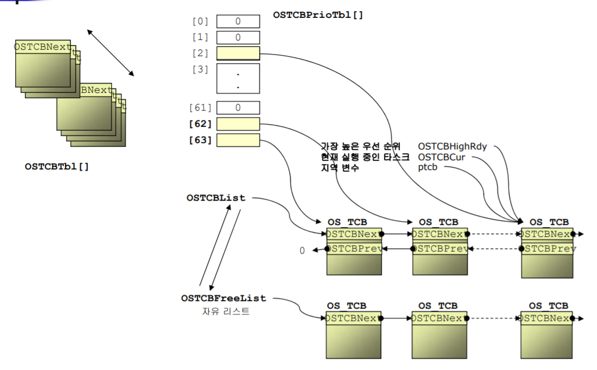

# MicroC/OS-2 Kernel

## MicroC/OS-2 Overview

- PORT 부분 : 실행되는 cpu 환경에 대해서 의존적인 부분. 이 부분을 수정하기 위해서는 실행환경에 대한 배경지식이 요구된다.
- Configuration 부분 : Application 작성시 설정이 가능한 부분

## Task type

- 무한루프가 존재하여 하드웨어가 켜져있으면 계속해서 실행되는 Task
- 일정 작업을 실행하면 바로 delete되는 Task

## Task Scheduling, priority

microC/os2에서는 총 64개의 Task가 생성될 수 있다. 이 중 priority 62번과 63번은 이미 예약되어 사용된다. priority는 Task마다 유일하게 지정되기 때문에 Task의 식별자로 사용될 수 있다.

- 62번 Task : statistics Task. 각종 하드웨어 사용량을 체크하는 Task이다
- 63번 Task : idle Task. 상위 우선순위의 모든 Task가 실행가능하지 않을 때 실행되는 Task. 아무일도 수행하지 않는다.

### Task State

- Dominant : Task가 아직 OS에 등록되지 않은 상태. OSTaskCreate(), OSTaskCreateExt()과 같은 함수를 이용해서 OS에 등록될 수 있다. 위 두 함수 호출시 실행될 수 있는 Candidate가 된다(Ready 상태). OSTaskCreateExt()는 Task를 생성할 때 추가적으로 인자를 전달할 수 있게 해준다.
- Ready : Scheduler에 의해 Running 상태로 바뀔 수 있는 상태. Running에 대한 candidate
- Running : cpu 자원을 확보하고 실행 중인 상태
- Delay : 실행을 멈추고 일정기간 동안 기다리는 상태. suspend 함수 호출로 만들 수 있다. 스케줄링 될 수 없다. 일정 기간이 지난 후에는 다시 ready 상태로 돌아간다.
- Waiting : 특정 이벤트가 실행될 때가지 실행을 멈추고 기다리는 상태. 스케줄링 될 수 없다.
- ISR : ISR이 실행되는 상태

### TCB

Task에 대한 정보를 포함하는 자료구조

#### OS_TCB 구조체의 필드

> *로 표시된 필드는 OSTaskCreateExt()함수를 호출한 경우에만 사용할 수 있다.

- OSTCBStkPtr : 테스크가 사용하는 stack의 top을 가리킨다
- OSTCBExtPtr* : 추가적인 TCB 구조를 사용하고자 할 때, 이 추가 TCP에 대한 포인터
- OSTCBStkBottom* : 테스크가 사용하는 stack의 bottom을 가리킨다.
- OSTCBStkSize : stack size
- OSTCBNext, OSTCBPrev : 다음, 이전 TCB에 대한 포인터
- OSTCBOpt* : Task를 생성할 때 사용하는 옵션
  - OS_TASK_OPT_STK_CHK
  - OS_TASK_OPT_STK_CLR
  - OS_TASK_OPT_SAVE_FP
- OSTCBDly : 딜레이가 끝날때까지 남은 clock tick
- OSTCBStat

#### TCB List

최대 Task에 대한 개수가 제한되어 있고, Task에 대한 우선순위는 static하게 정해지기 때문에 미리 빈 TCB를 여러개 만들어 두고 List 형태로 관리한다. 그 다음 OSTaskCreate 함수가 호출되면 OSTCB free list에 있던 TCB하나를 설정하여 OSTCB list에 추가하는 형태로 관리한다.

