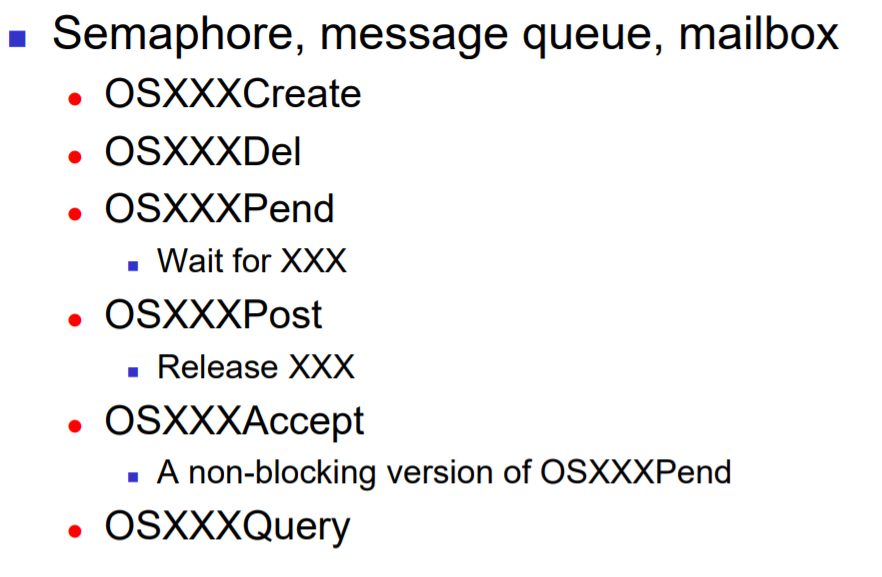
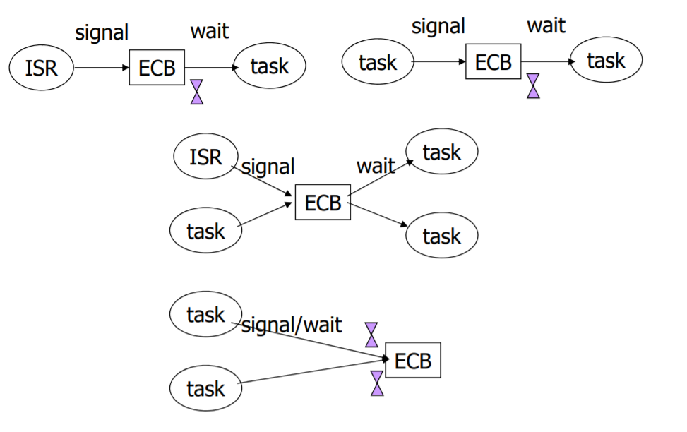
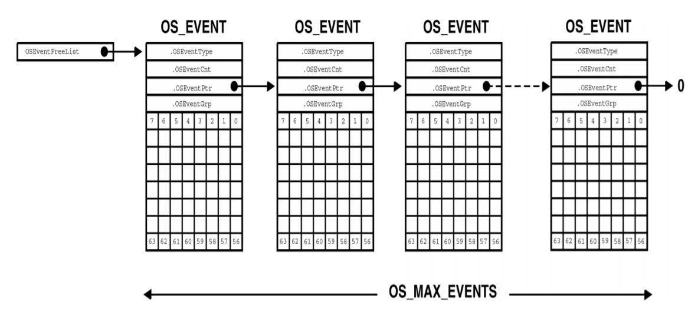
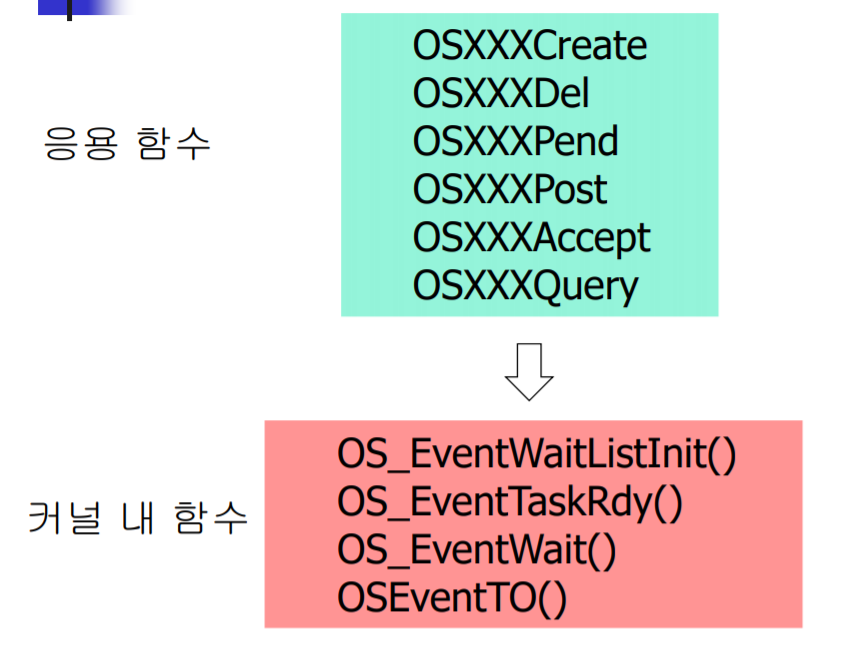

# Task Synchronization 1

- mail box, message queue, semaphore, mutex

## Task Synchronization을 위한 자료구조 - Event Control Block(ECB)

- mail box, message queue, semaphore, mutex와 같은 동기화 함수를 사용하기 위해서 특정 자료구조를 도입하였다.
- Event Control Block은 특정 Synchronization 알고리즘을 수행하기 위한 여러 정보를 담고 있는 구조체이다.
- 스케줄러가 OSRdyGrp과 OSRdyTbl을 관리하는 것과 유사한 형태로 되어있다.
- mail box, message queue, semaphore, mutex에서 동일하게 사용하도록 Event Control Block과 Synchronization 관련 함수들의 이름은 동일한 형태로 작성되어 있다.



Event Control Block을 통해서 Synchronization을 수행하는 형태는 다음 그림처럼 여러개이다.



### Event Control Block Structure : struct OS_EVENT

Event Control Block은 다음과 같은 형태의 구조체 형태로 선언되어 있다.

```c
typedef struct {
    void *OSEventPtr;   // OSEventType 마다 용도가 다름
    INT16U OSEventCnt;  // OSEventType 마다 용도가 다름
    INT8U OSEventType;
    INT8U OSEventGrp;   // 특정 이벤트를 기다리는 Task 정보
    INT8U OSEventTbl[OS_EVENT_TBL_SIZE]; // 특정 이벤트를 기다리는 Task 정보
} OS_EVENT;
```

- OSEventType : ECB의 용도를 나타내는 필드
  - OS_EVENT_TYPE_SEM
  - OS_EVENT_TYPE_MUTEX
  - OS_EVENT_TYPE_MBOX
  - OS_EVENT_TYPE_Q
- OSEventCnt
  - 세마포어 : 세마포어 카운트 저장
  - 상호 배제 세마포어(MUTEX) : PIP 저장
- OSEventPtr : 메시지 큐나 mail box에서만 사용됨. 생성된 해당 메시지에 대한 포인터
- OSEventGrp, OSEventTbl : 특정 이벤트 발생을 기다리는 태스크들의 리스트

### 이벤트 대기상태 Task 리스트 관리

#### 이벤트 대기 Task insertion

```c
pevent->OSEventGrp |= OSMapTbl[prio >> 3];
pevent->OSEventTbl[prio >> 3] |= OSMapTbl[prio & 0x07];
```

#### 이벤트 대기 list에서 Task 제거

```c
if (pevent->OSEventTbl[prio >> 3] &= ~OSMapTbl[prio & 0x07])
    pevent->OSEventGrp &= ~OSMapTbl[prio >> 3];
```

#### 이벤트 대기 list 중 우선순위가 가장 높은 Task 찾기

```c
y = OSUnMapTbl[pevent->OSEventGrp];
x = OSUnMapTbl[pevent->OSEventTbl[y]];
prio = (y << 3) + x;
```

### Free Event Control Block

TCB와 마찬가지로 ECB 역시 미리 여러개의 OS_EVENT 구조체를 만들어두고 관리한다. 이렇게 미리 만들어 두고 관리하는 이유는 ECB가 필요할 때 ECB를 생성하는 시간을 소모하지 않고 빠른시간 내에 사용하기 위해서이다.  
미리 생성되는 ECB 개수는 OS_CFG.H 파일에서 OS_MAX_EVENTS 값을 통해 설정할 수 있다. 초기에 OS_Init 함수를 호출하면 모든 ECB가 OSEventFreeList에 연결되어 관리된다. 이 후 ECB를 생성하는 함수를 호출하면, OSEventFreeList에서 삭제되어 사용된다.



### Operations


