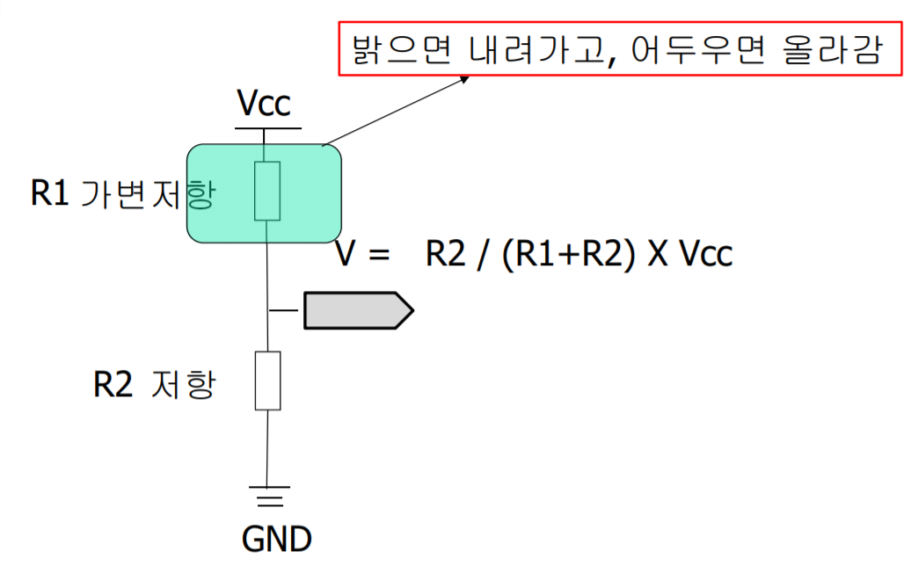
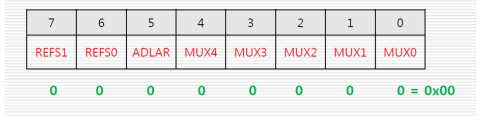
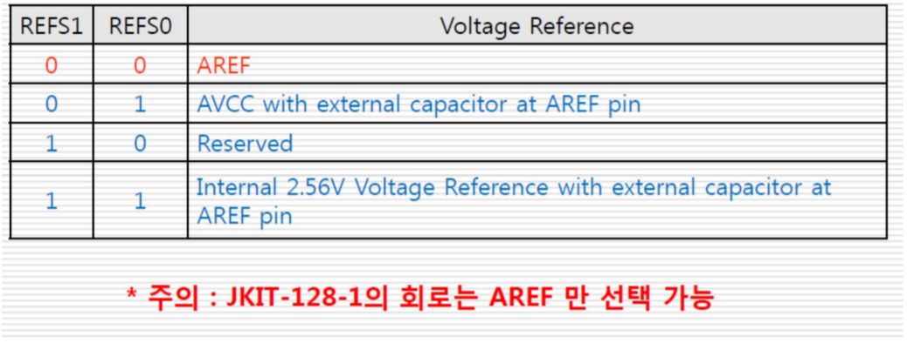
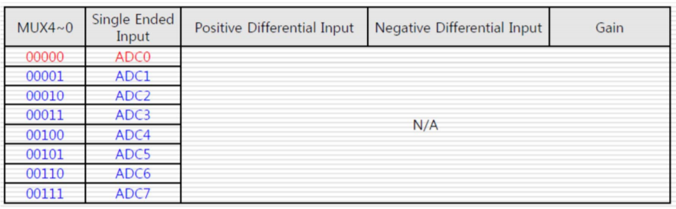
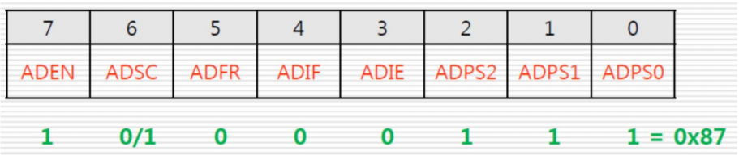
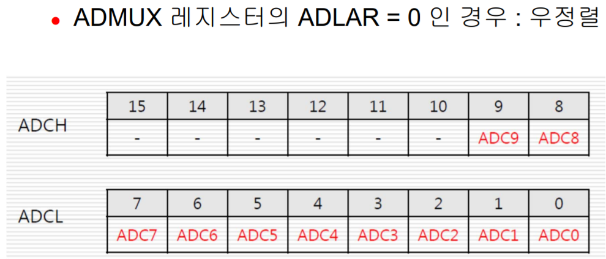
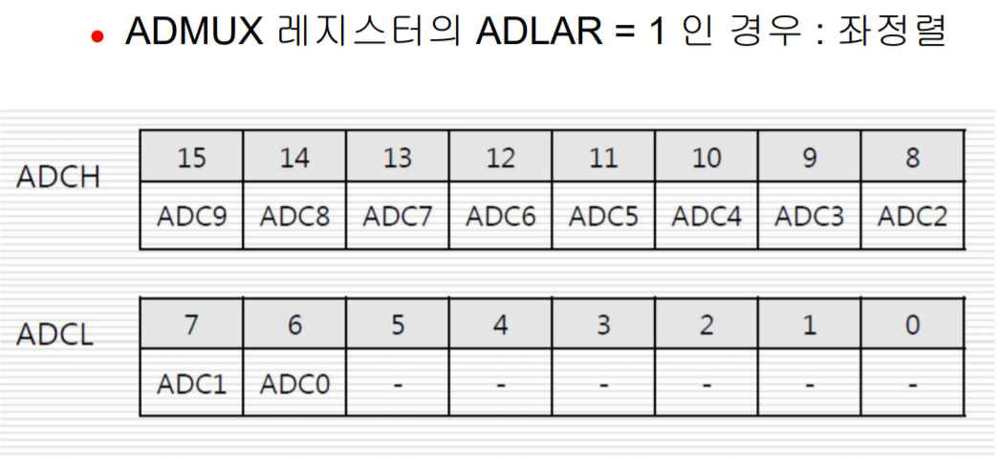
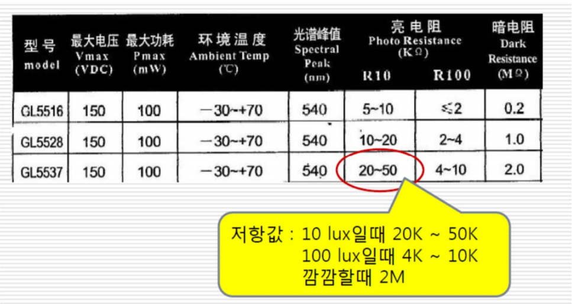
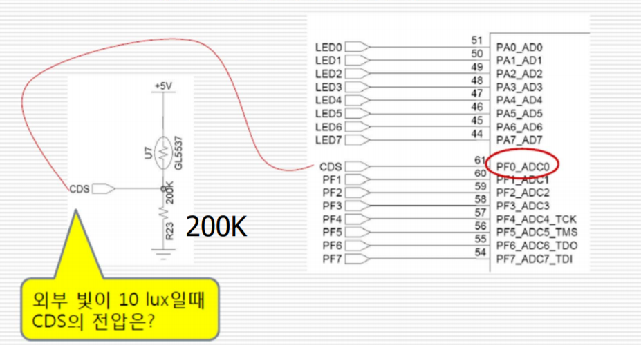

# Promgramming_on_an_embedded_system3

## 광센서, A/D 컨버터

### CdS 센서

황화카드뮴 센서. 빛이 밝으면 내부 저항이 내려가고, 빛이 어두워지면 내부 저항이 올라가는 성질을 가지고 있음.



빛의 양에 따라서 저항값이 달라지는 가변저항의 역할을 하기 때문에 특정 시점에서 달라지는 전압값을 이용하여 빛의 양을 측정할 수 있다.

전압값은 아날로그 물리량이다. 이를 마이크로프로세서에서 처리하기 위해서는 디지털 값으로 변환해야한다. 이와 같은 기능을 하는 것이 A/D Converter(Analog Digital Converter)이다.

### A/D 컨버터

아날로그 데이터를 직렬 또는 병렬 디지털 데이터로 변환하는 장치. 측정하려는 아날로그 물리량의 범위 및 시스템의 응용 목적에 따라서 적절한 정밀도와 분해능을 갖는 컨버터를 사용한다.

#### 분해능(Resolution)

- 디지털 데이터를 한 단위 변화시키기 위한 아날로그 입력의 최소 변화
- n비트 컨버터의 경우 표현할 수 있는 최소 데이터 범위는 1/(2^n)

#### 변환시간(Conversion time)

아날로그 데이터를 디지털 데이터로 변환시키는데 걸리는 시간. 초당 샘플링 개수 (샘플링 속도)로 표현된다.

> jkit-128-1 에서는 10비트 분해능, 13~260&micro;s (50 khz ~ 1Mhz) 의 성능을 갖는 A/D 컨버터 사용

### ATmega128에서 A/D 컨버터 관련 레지스터

- **ADMUX** : A/D 컨버터 멀티플렉서 선택 레지스터
- **ADCSRA** : A/D 컨버터 제어 및 상태 레지스터A
- **ADCH, ADCL** : A/D 컨버터 데이터 레지스터

### ADMUX (ADC Multiplexer Selection Register)

- ADC 모듈의 기준 전압 설정
- 변환된 데이터의 정렬 설정
- ADC 모듈의 아날로그 입력 채널 설정



> 우리가 사용할 jkit-128-1 에서는 이 레지스터를 0으로 설정하여 특별히 해줄 것이 거의 없다.

#### REFS1, REFS2 (비트 7, 6)

Reference Selection Bit. ADC 모듈의 기준 전압 설정 비트. jkit-128-1 모듈에서는 5V (AREF) 만 사용할 수 있다.



#### ADLAR (비트 5), MUX 4~0 (비트 4~0)

- ADLAR : ADC Left Adjust Result. 변환된 데이터를 ADCH, ADCL 16비트 상에서 왼쪽으로 정렬할 것인지를 설정하는 비트.
- MUX 4~0 : Analog Channel and Gain Bit. 아날로그 입력 채널 선택. 설정할 필요 없음.



### ADCSRA (ADC Control and Status Register A)

ADC 모듈의 동작을 설정하고, 동작 상태를 확인할 수 있는 레지스터.



#### ADEN (비트 7)

- ADC Enable. ADC 모듈이 동작하도록 설정.

#### ADSC (비트 6)

- ADC Start Conversion.
- 1로 설정하면 변환 시작. 가장 처음 변환은 25개의 ADC 클록 주기가 필요. 이 후 변환은 13개 클록이 요구됨.
- 변환이 종료된 후 자동으로 0으로 초기화된다.

#### ADFR (비트 5)

- ADC Free Running 모드 설정
- 이 비트가 1로 설정되어 있으면 자동으로 계속 변환을 시작함. (Free Running mode)
- 이 비트가 0으로 설정되어 있으면 사용자가 수동으로 ADSC를 1로 설정할 때만 변환이 이루어진다. (Single Conversion mode)

#### ADIF (비트 4)

- ADC Interrupt Flag
- ADC 인터럽트 요청 플래그. ADC 변환이 끝나고 ADCH, ADCL 데이터 레지스터에 값이 업데이트 되면 이 비트가 1로 설정된다
- 만약 ADIE 값이 1로 설정되어 있고, SREG 7비트가 1로 설정되어 있으면 ADC 변환이 끝난 시점에서 ADIF 가 1로 설정되고, ADC 인터럽트가 발생한다

#### ADIE (비트 3)

- ADC Interrupt Enable
- ADC 변환 완료 인터럽트 허용
- ADC 변환 완료 인터럽트를 개별적으로 설정
- SREG 의 비트 7(I)이 1로 설정되어 있어야 한다.

#### ADPS2~0 (비트 2~0)

- ADC Prescaler Selection bit. 특별히 고려할 필요 없음

### ADCH, ADCL

- AD 컨버터의 변환 결과를 저장하는 데이터 레지스터
- 변환 결과의 10비트 값이 ADCH, ADCL 2개의 레지스터에 나뉘어서 저장된다.
- 변환 결과는 기준 전압에 대한 비율 상수를 의미한다.
- 예를 들어 기준 전압이 5V인 경우, 0은 0V, 1023은 5V를 의미한다.




### jkit-128-1에서 사용하는 CdS 센서 규격



### 보드 연결 회로도



CDS는 F 포트 0번 핀에 연결되어 있다. 또한 PF0은 ADC 컨버터 0번 채널에 연결되어 있다. CdS 센서의 저항 연결은 위와 같이 되어 있다. 이를 토대로 CdS 센서의 저항값에 따른 ADC 변환 데이터 값은 다음 식을 통해서 계산할 수 있다.

$$
{R_{23} \over (R_{GL5337} + R_{23})} * 1023
$$

### ADC를 이용한 프로그래밍 과정

#### 초기화

- ADMUX : AREF 설정. 입력 채널 설정(MUX). 우정렬. -> 0x00
- ADCSRA : ADEN 1 설정. ADFR 0 설정. 분주 설정 (111)

### 데이터 읽기

- ADCSRA : ADSC 1설정
- ADCH, ADCL : 데이터 읽기

> 가로등 켜기 예제

```c
#include <avr/io.h>
#define CDS_VALUE   871
void init_adc();
unsigned short read_adc();
void show_adc(unsigned short value);

void init_adc()
{
    ADMUX = 0x00;
    ADCSRA = 0x87;
}

unsigned short read_adc()
{
    unsigned char adc_low, adc_high;
    unsigned shor value;

    ADCSRA |= 0x40;     // start conversion
    while((ADCSRA & 0x10) != 0x10); // ADC 변환 완료 검사

    adc_low = ADCL;
    adc_high = ADCH;
    value = (adc_high << 8) | adc_low;
    // adc_high char형인데 overflow 안나나?

    return value;
}

void show_adc(unsigned short value)
{
    if (value < CDS_VALUE)
        PORTA = 0xff;
    else
        PORTA = 0x00;
}

int main()
{
    // CdS 센서 PF0 핀에 연결되어 있던데
    // 입출력 세팅 안해도 되는가?
    unsigned short value;
    DDRA = 0xff;
    init_adc();
    while(1)
    {
        value = read_adc();
        show_adc(value);
    }
}
```

## 온도 센서, I2C protocol
